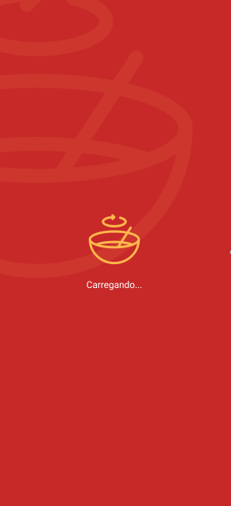
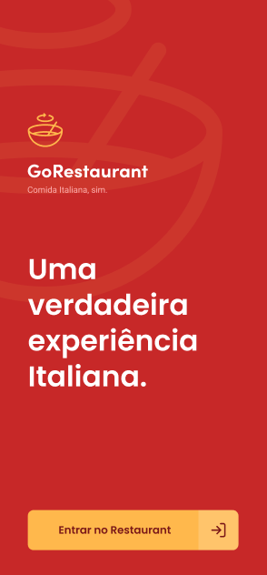
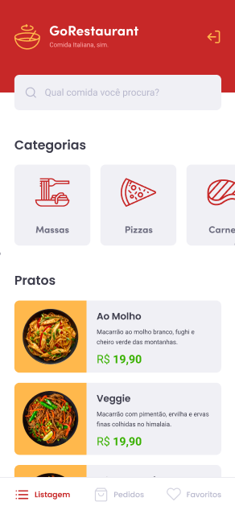
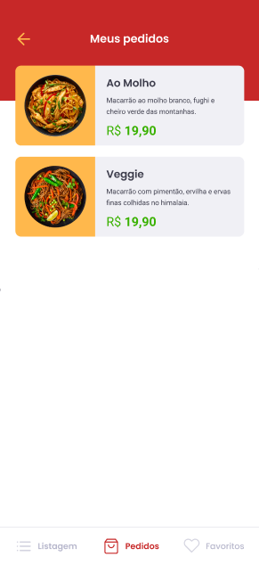
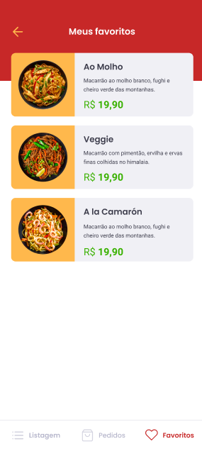
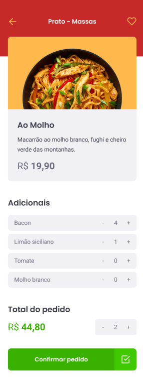

<h3 align="center">
  Desafio 11: GoRestaurant Mobile
</h3>

## :rocket: Sobre o desafio

Nesse desafio, usando TypeScript, foi aplicado os conceitos do React Native e foi desenvolvido a aplicação GoRestaurant Mobile, um pequeno app para pedidos de comida, uma aplicação que irá se conectar a uma Fake API, e exibir e filtrar os pratos de comida da API e permitir a criação de novos pedidos.

Telas da aplicação:

    
    
    
    
    
    

